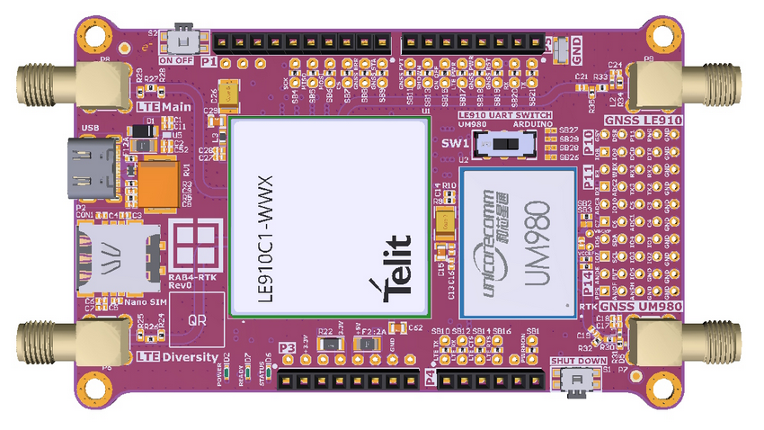
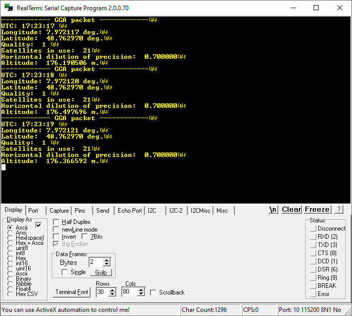
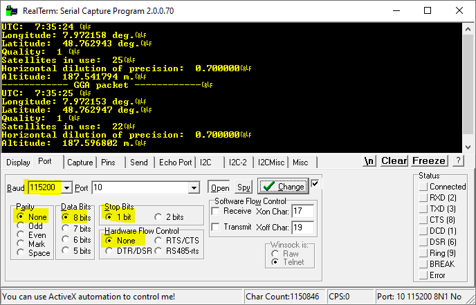

# RDK2_UM980_RoverMode

This example demonstrates how to use the RDK2 in combination with the RAB-RTK to read the position (latitude, longitude, and height) of the UM980 sensor.

<figure>
    
    <figcaption>RAB-RTK module to be plugged on the RDK2.</figcaption>
</figure>

<figure>
    
    <figcaption>Screenshot of serial output (KitProg UART).</figcaption>
</figure>

## Requirements

- [ModusToolbox™ software](https://www.infineon.com/cms/en/design-support/tools/sdk/modustoolbox-software/) v3.x
- [RDK2](https://www.rutronik24.com/product/rutronik/rutdevkit-psoc62/16440182.html)
- [RAB-RTK](https://www.rutronik.com/innovations)
- GPS Antenna

## Using the code example

- Build the project and program it. More information here: [https://github.com/RutronikSystemSolutions/RDK2_Documents](https://github.com/RutronikSystemSolutions/RDK2_Documents)
- Connect the GNSS UM980 antenna
- Connect the laptop to the RDK2 by using the KitProg interface
- Check in your device manager that the RDK2 has been discovered
- Using a serial terminal on your computer, monitor the serial port (115200 bauds, Parity: None, Data bits: 8, Stop Bits: 1)

<figure>
    
    <figcaption>Screenshot of serial output (KitProg UART).</figcaption>
</figure>

## Legal Disclaimer

The evaluation board including the software is for testing purposes only and, because it has limited functions and limited resilience, is not suitable for permanent use under real conditions. If the evaluation board is nevertheless used under real conditions, this is done at one’s responsibility; any liability of Rutronik is insofar excluded. 

